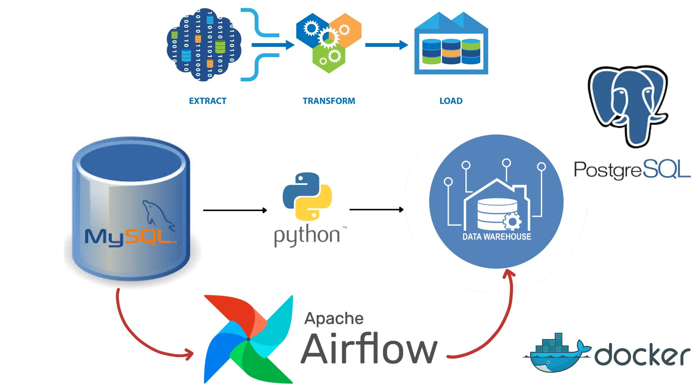
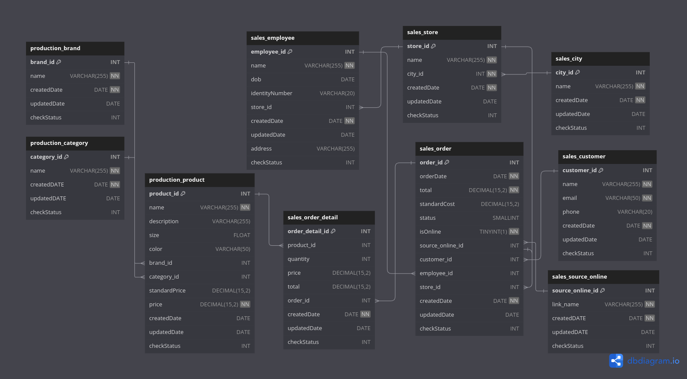
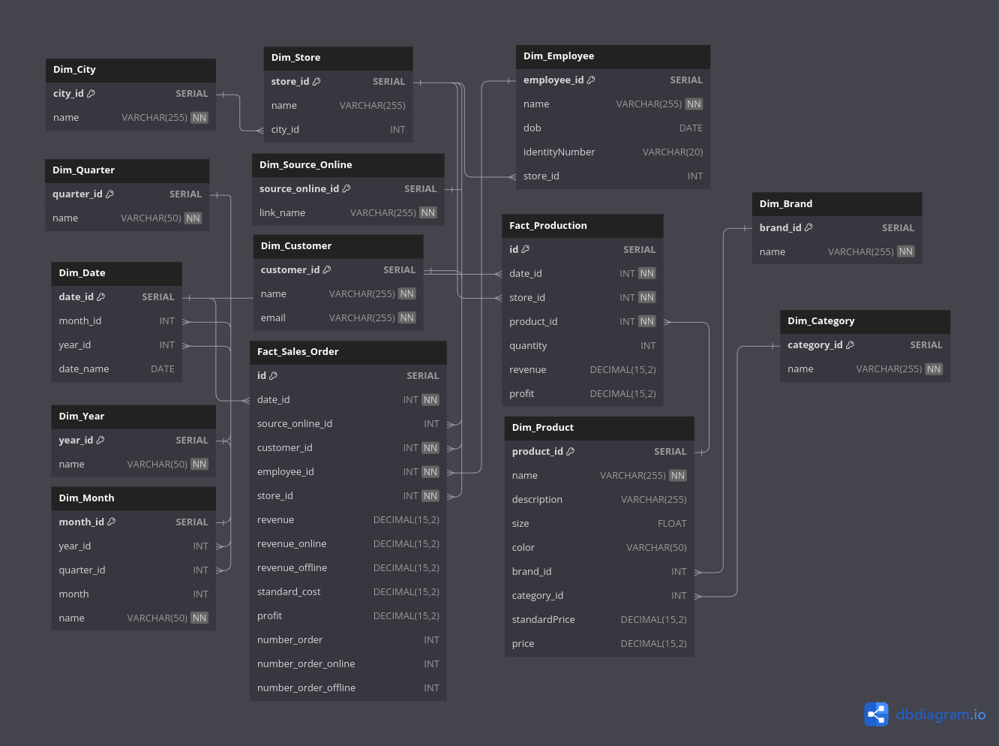
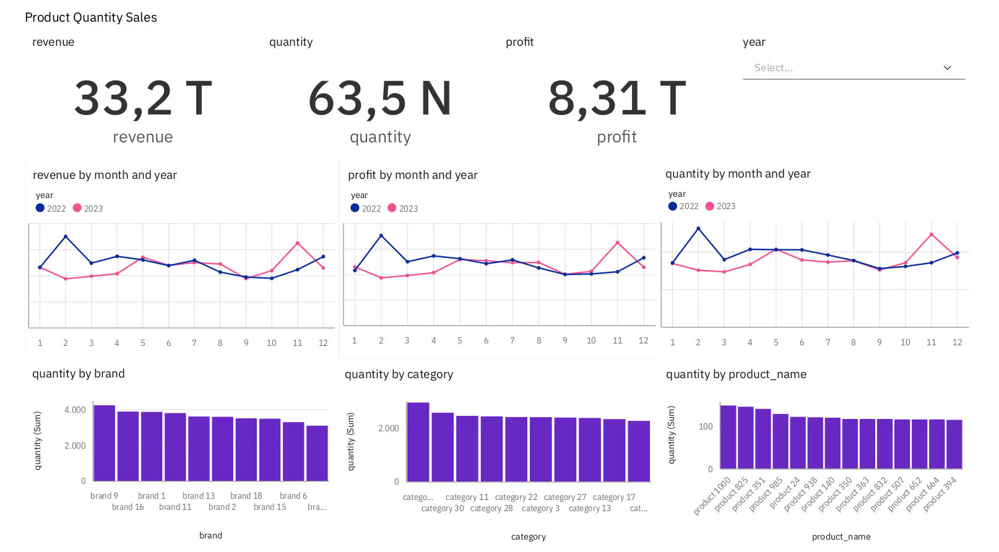

<h1>SALES DATA ENGINEER PROJECT</h1>



- [1. Project Overview](#1-project-overview)
- [2. Project Details](#2-project-details)
  - [2.1. Database Design and Data Flow](#21-database-design-and-data-flow)
  - [2.2. Staging and Data Warehouse Layers](#22-staging-and-data-warehouse-layers)
  - [2.3. Dashboard Requirements](#23-dashboard-requirements)
- [3. Technology Stack](#3-technology-stack)
- [4. Architecture](#4-architecture)
- [5. Getting Started](#5-getting-started)
  - [5.1. Prerequisites](#51-prerequisites)
  - [5.2. Running the Project](#52-running-the-project)
  - [5.3. Backup Process](#53-backup-process)
  - [5.4. Dashboard Access](#54-dashboard-access)


## 1. Project Overview

This project is designed as a data engineering solution for managing sales data in a chain of electronics stores. It involves setting up a MySQL database for daily transaction data, a PostgreSQL-based data warehouse with a two-layer structure (Staging and Data Warehouse), and creating dashboards to visualize sales performance and other KPIs. Data processing and loading is orchestrated using Apache Airflow, while the ETL operations are managed using Python and SQLAlchemy. The entire setup is containerized with Docker Compose, enabling easy deployment and scalability.

## 2. Project Details

### 2.1. Database Design and Data Flow

The source data is stored in a MySQL database that manages the daily sales data. The following entities are modeled:

- **Product**: Stores product information including name, category, standard price, price, and brand.
- **Store**: Contains store details like name and city.
- **Employee**: Stores information about store employees.
- **Customer**: Holds customer details including name and email.
- **Order**: Captures details of each order, including product, customer, store, order date, and online/offline status. For online orders, the platform (e.g., Tiki, Shopee) is also recorded.

The MySQL database schema is shown below:



### 2.2. Staging and Data Warehouse Layers

The data flows from the MySQL database to the PostgreSQL data warehouse. The warehouse has two layers:

- **Staging Layer**: Mirrors the MySQL schema but includes control columns (`insertDate`, `updateDate`, `sourceSystem`, `isProcessed`). These control columns simplify the ETL process. The Staging layer has no constraints, enabling easy data loading.

- **Data Warehouse Layer**: This layer follows a star schema, designed to support complex analytical queries. The schema is as follows:



### 2.3. Dashboard Requirements

To meet the client’s needs, a dashboard was created with the following metrics:

- Revenue, profit, and order count segmented by product, store, employee, city, and customer.
- Quantity of products sold by category and brand.
- Online/offline revenue and order count ratios over time.
- Analysis of online orders by source (e.g., Tiki, Shopee).
- Total revenue by store, employee, and product.
- Top 10 best-selling and worst-selling products.
- Top 10 employees and stores by highest and lowest revenue.

A sample of the dashboard is shown below:



To make dashboard like this, I created 2 materialized view in data warehouse named `view_fact_sale_orders` and `view_fact_production` for exporting CSV file to creating dashboard (If use postgres on cloud, can use directly data from it). Use CSV files for locally running.

## 3. Technology Stack

- **MySQL**: Used as the transactional database for storing daily sales data.
- **PostgreSQL**: Hosts the data warehouse with staging and analytical layers.
- **Apache Airflow**: Manages and schedules ETL workflows.
- **Python with SQLAlchemy**: Primary ETL tool used for data manipulation and loading.
- **IBM Cognos Analytics**: Used for creating and visualizing the dashboard.
- **Docker**: Containerizes the entire setup for easy deployment and portability.

## 4. Architecture

The architecture consists of the following components:

- **Data Ingestion**: MySQL stores transaction data, which is then periodically ingested into the PostgreSQL staging layer.
- **ETL Process**: Data is loaded from the staging layer to the data warehouse using Python and SQLAlchemy scripts scheduled in Apache Airflow.
- **Data Warehouse**: The PostgreSQL data warehouse serves as the central data repository for analysis.
- **Dashboard Visualization**: IBM Cognos Analytics generates real-time dashboards for key sales metrics.

## 5. Getting Started

### 5.1. Prerequisites

Before running the project, ensure the following are installed:

- **Docker and Docker Compose**: Required for containerizing and running the services.
- **IBM Cognos Analytics Account**: To access the dashboard on IBM Cognos, if not running locally.

### 5.2. Running the Project

0. **Clone Project Repository:**
    ```bash
    git clone https://github.com/thangquang09/sales-dataengineer-project
    cd sales-dataengineer-project
    ```

1. **Set Script Permissions**: Allow bash scripts to execute by running:
    ```bash
    find . -type f -name "*.sh" -exec chmod +x {} \;
    ```

2. **Start Docker Containers**: Use Docker Compose to bring up all necessary containers.
    ```bash
    docker compose up -d
    ```
    Once all containers are up, access the Airflow webserver at `localhost:8080`. Default login credentials are:
    - **Username**: `admin`
    - **Password**: `admin`

3. **Trigger Airflow Workflows**: In the Airflow webserver, click the "Play" button to start data loading from the MySQL database into the Data Warehouse.

4. **PgAdmin Access**: Access PgAdmin at `localhost:8081` with the following settings:
    - **Username**: `thangquang`
    - **Password**: `thangquang`
    - **Host**: `postgres_container`
    - **Port**: `5432`

### 5.3. Backup Process

To backup the Data Warehouse, run the following command:

```bash
docker exec -it postgres_container bash -c "/docker-entrypoint-initdb.d/backup_postgres.sh"
```

This command saves a SQL script in the `backups` folder, allowing for scheduled or periodic backups via cron jobs.

### 5.4. Dashboard Access

- **IBM Cognos Analytics Dashboard**: View the dashboard online through IBM Cognos at the following link:
  [IBM Cognos Analytics Dashboard](https://ap1.ca.analytics.ibm.com/bi/?perspective=dashboard&pathRef=.my_folders%2FSales-DE-Project-2&action=view&mode=dashboard&subView=model000001930fcffd47_00000000)

- **Local Dashboard Access**: A PDF version of the dashboard can be accessed locally at [Sales-DE-Project-2.pdf](Sales-DE-Project-2.pdf).