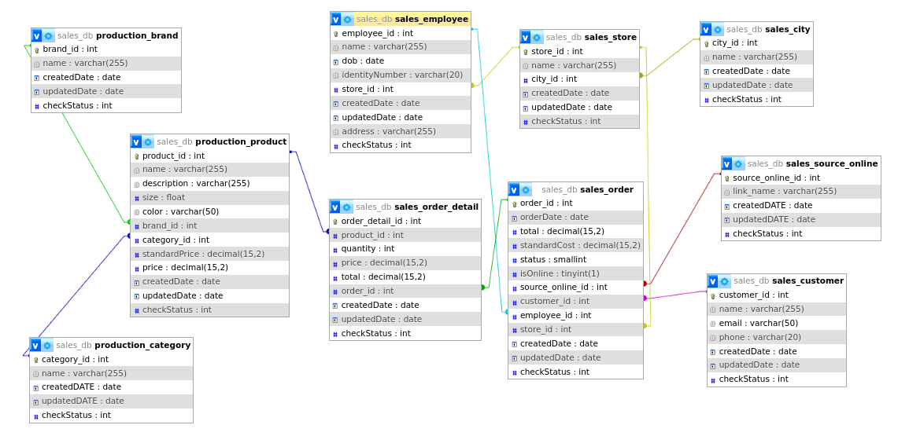
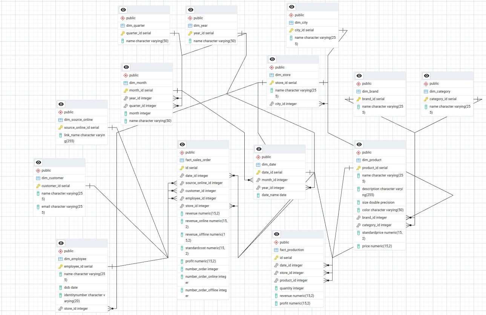
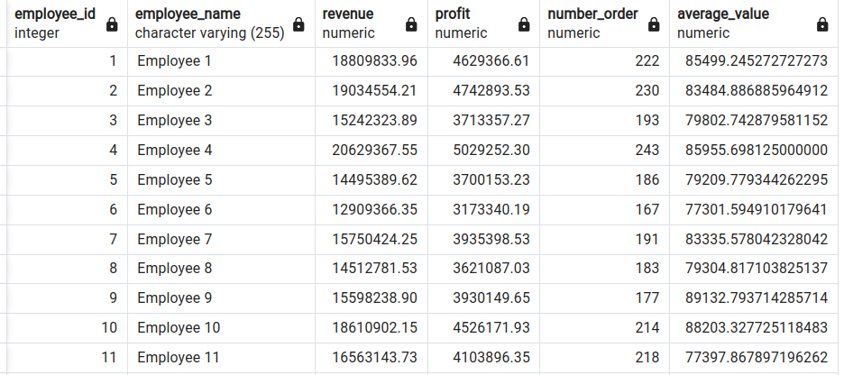
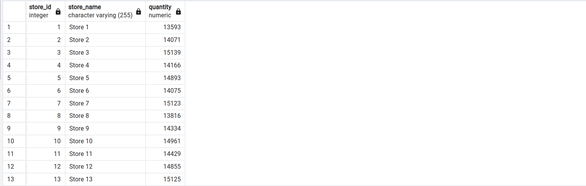
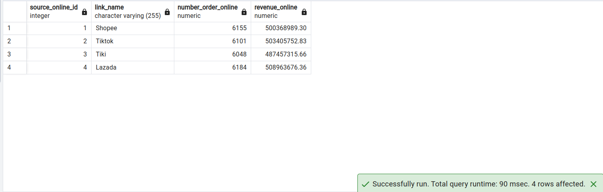
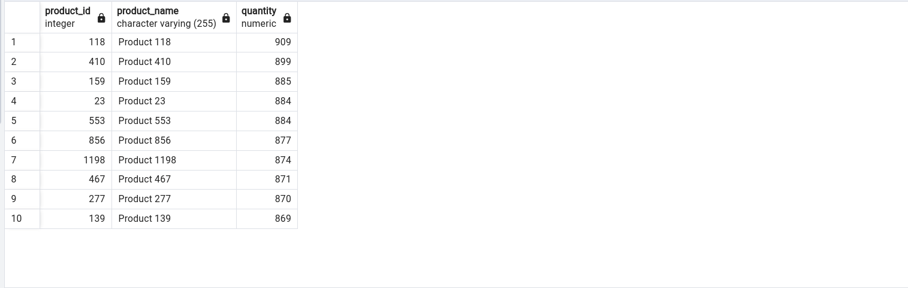
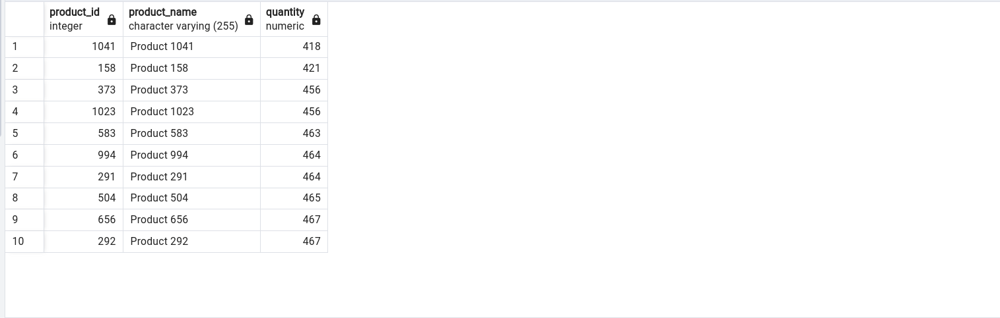
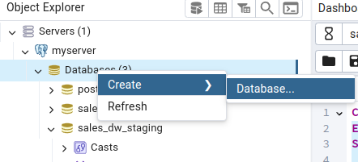
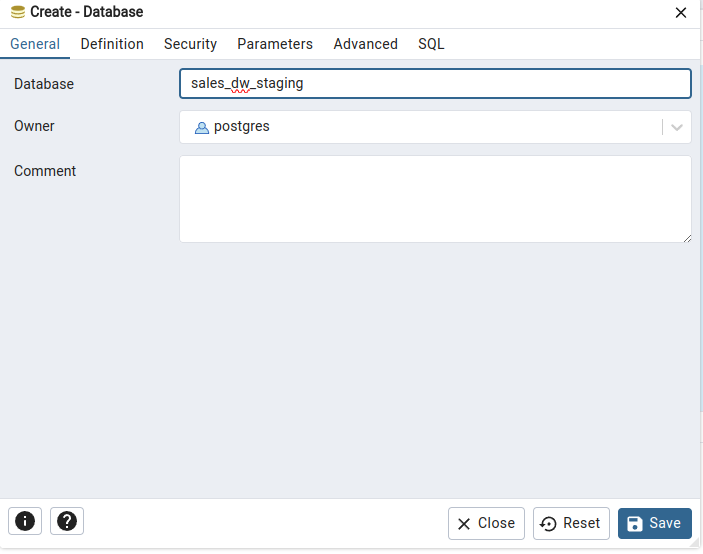

# SALES DATA ENGINNER PROJECT


## Introduction

This is my Data Engineer Project on sales data. In this project, I designed a MySQL database to store daily transaction data and a two-layer Data Warehouse using PostgreSQL, consisting of a Staging layer and a Data Warehouse layer. In the Data Warehouse, I created VIEWS to meet the requirements that will be listed later, allowing the construction of dashboards to display these requirements. The tool I used for ETL is Python, and I scheduled periodic data loads into the Data Warehouse using Apache Airflow.

## Requirements

The client company needs to manage a chain of electronics stores, requiring management of orders, products, stores, employees, and customers:

- **Product**: name, category, standard price, price, brand
- **Store**: name, city
- **Employee**: name, store
- **Customer**: name, email
- **Order**: details of product, customer, store, order date, online/offline status (if online, then specify "Tiki", "Shopee", etc.)

Build a dashboard that displays:

- Revenue, profit, number of orders, average value based on criteria: product, store, employee, city, customer
- Quantity of products sold by category, store, city
- Ratio of online/offline revenue and order numbers over time
- For online orders, the structure of order numbers and revenue by source ("Tiki", "Shopee", etc.)
- Total revenue by store, employee, product
- Top 10 best-selling and worst-selling products
- Top 10 employees and stores with the highest and lowest revenue.

## Design MYSQL EDR

This is the schema of the source database that I have designed. The RDBMS used is MySQL.



## Staging and Data Warehouse

The schema of staging layer is exactly the same as MySQL's schema but adds control columns `insertDate`, `updateDate`, `sourceSystem`, `isProcessed`, but without any constraint because it help me load data more easy.

The schema of data warehouse layer is in picture below:



This DW has 3 materialized views to support creating dashboard `view_store_city_employee_cus`, `view_quantity_cate_store_city`, `view_online_offline_summary`.

We will have some insight:

- Revenue, prodit, number of orders, average value of employee:

- Quantity of products sold by store

- For online orders, the structure of order numbers and revenue by source ("Tiki", "Shopee", etc.)

- Top 10 best-selling products

- Top 10 worst-selling products


## How to run?

1. Firstly, you have to install mysql and create sales_db with mysql, the script to initial is [initial_db_MySQL.sql](SQLScript/initial_db_MySQL.sql), the script will help you create sample data randomly. It maybe runs in 10-15 minutes.
2. Secondly, you go to postgreSQL (I suggest use pgAdmin4 for friendly user interface) and create 2 database `sales_dw_staging` and `sales_dw`.




3. You use SQL script [initial_dw_postgreSQL.sql](SQLScript/initial_dw_postgreSQL.sql) and [initial_dw_staging_postgreSQL.sql](SQLScript/initial_dw_staging_postgreSQL.sql) to create tables, constraints, views for staging and dw layers.
4. Go to [mysql_conf.txt](mysql_conf.txt), [staging_conf.txt](staging_conf.txt), [dw_conf.txt](dw_conf.txt) and modify your information to connect to your databases.
5. Install requirement modules
   ```bash
   python3 -m pip install -r requirement.txt
   ```
6. Finally run [ETL_pipeline.py](ETL_pipeline.py) by
   ```bash
   python3 ETL_pipeline.py
   ```
7. If you want to use Airflow to run it periodically, you have to install airflow and move project to your airflow DAG directory, the main dag is [airflow_dag.py](airflow_dag.py), then it will be ok.

