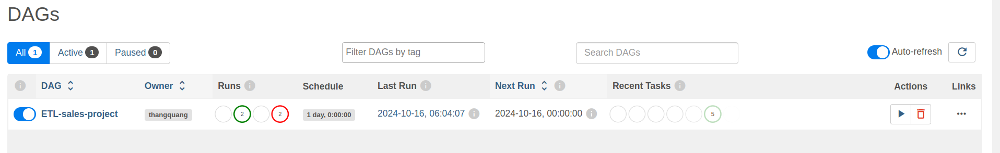

# SALES DATA ENGINNER PROJECT


**TABLE OF CONTENT**

- [SALES DATA ENGINNER PROJECT](#sales-data-enginner-project)
  - [Introduction](#introduction)
  - [Tools](#tools)
  - [Requirements](#requirements)
  - [Design MYSQL EDR](#design-mysql-edr)
  - [Staging and Data Warehouse](#staging-and-data-warehouse)
  - [How to run?](#how-to-run)
    - [0. Allows scripts to run](#0-allows-scripts-to-run)
    - [1. Docker Compose](#1-docker-compose)
    - [2. Airflow Webserver](#2-airflow-webserver)
    - [3. PgAdmin](#3-pgadmin)
    - [4. Backup DataWarehouse](#4-backup-datawarehouse)


## Introduction

This is my Data Engineer Project on sales data. In this project, I designed a MySQL database to store daily transaction data and a two-layer Data Warehouse using PostgreSQL, consisting of a Staging layer and a Data Warehouse layer. In the Data Warehouse, I created VIEWS to meet the requirements that will be listed later, allowing the construction of dashboards to display these requirements. The tool I used for ETL is Python (ORM by SqlAlchemy), and I scheduled periodic data loads into the Data Warehouse using Apache Airflow. All techniques will be packaged using Docker Compose.

## Tools

- MySQl
- PostgreSQL
- Airflow
- Python SqlAlchemy

## Requirements

The client company needs to manage a chain of electronics stores, requiring management of orders, products, stores, employees, and customers:

- **Product**: name, category, standard price, price, brand
- **Store**: name, city
- **Employee**: name, store
- **Customer**: name, email
- **Order**: details of product, customer, store, order date, online/offline status (if online, then specify "Tiki", "Shopee", etc.)

Build a dashboard that displays:

- Revenue, profit, number of orders value based on criteria: product, store, employee, city, customer
- Quantity of products sold by category, store, city
- Ratio of online/offline revenue and order numbers over time
- For online orders, the structure of order numbers and revenue by source ("Tiki", "Shopee", etc.)
- Total revenue by store, employee, product
- Top 10 best-selling and worst-selling products
- Top 10 employees and stores with the highest and lowest revenue.

## Design MYSQL EDR

This is the schema of the source database that I have designed. The RDBMS used is MySQL.


## Staging and Data Warehouse

The schema of staging layer is exactly the same as MySQL's schema but adds control columns `insertDate`, `updateDate`, `sourceSystem`, `isProcessed`, but without any constraint because it help me load data more easy.

The schema of data warehouse layer is in picture below:


This DW has 3 materialized views to support creating dashboard `view_store_city_employee_cus`, `view_quantity_cate_store_city`, `view_online_offline_summary`.

We will have some insight:

- Revenue, profit, number of orders, average value of employee:

- Quantity of products sold by store

- For online orders, the structure of order numbers and revenue by source ("Tiki", "Shopee", etc.)

- Top 10 best-selling products

- Top 10 worst-selling products


## How to run?

### 0. Allows scripts to run

You need to `chmod +x` for every bash script in this project.

```
find . -type f -name "*.sh" -exec chmod +x {} \;
```

Should be with `sudo`.

### 1. Docker Compose

```bash
docker compose up -d
```

When all containers are finished, you go to `localhost:8080`, default port of airflow webserver, you can login with `admin:admin` which is username and password.

### 2. Airflow Webserver



Click "Play" button to trigger


### 3. PgAdmin

You can go to `localhost:8081`, this is pgAdmin, you can add server which config:
- username: thangquang
- password: thangquang
- port: 5432
- host name: postgres_container


### 4. Backup DataWarehouse

You can run this bash script to backup this data warehouse:
```bash
docker exec -it postgres_container bash -c "/docker-entrypoint-initdb.d/backup_postgres.sh"
```

Then SQL script will be saved in [backups](backups) folder. It can be in cronjob for backup periodically.
